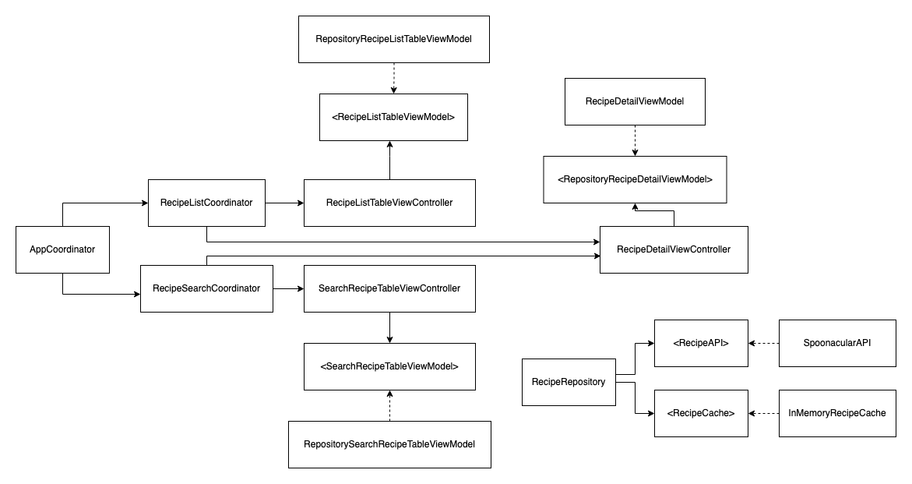

# iOS Tech Interview
This repository contains the code of the iOS Tech Interview.
The app consists of a series of screens that show a list of recipes provided by [Spoonacular](https://spoonacular.com/food-api).
It uses an MVVM-C architecture, where `Coordinators` are used to manage the app flows, and `ViewModels` take care of connecting the model to the view.

### Some of the challenges that needed to be taken into account
The provided API had a low limit of request allowed. This made it necessary to have a way of caching the requests. This was achieved by creating a class, `RecipeRepository`, that abstracts the calls to the API and uses the cache when available. Since this API provides mostly static content, we can cache all the requests without issues. While this repository includes a simple `InMemoryCache` that simply caches the results of the different API calls in memory, because it is implemented behind the interface `<RecipeCache>`, it should be easy to implement a more complex persisted cache and swap it without changing anything else in the app. 

The API returns different objects, or at least the same object with different fields, when calling endpoints that return a list of results, or just the detail of an item.
To keep this abstracted from the business logic of the app, there are some intermediary objects that are used to decode the API response that are then translated into the domain objects.

The API provided the option to send the API key in the query string or in a custom header. This app sends the API key using a custom header, since it is more secure. By sending it in the query string, it is more prone to be logged somewhere on its way to the server, thus leaking the credentials.

### Possible improvements
As discussed above, a nice improvement will be to use some kind of persisted cache. This will allow the app to load faster, and be used without an internet connection even after it is killed and opened again.

Another nice improvement will be to add favorites. By keeping track of which recipes the user has saved, and downloading all the related data, we can have a separate tab with a list of recipes that will always be available to the user. Even in offline mode.
